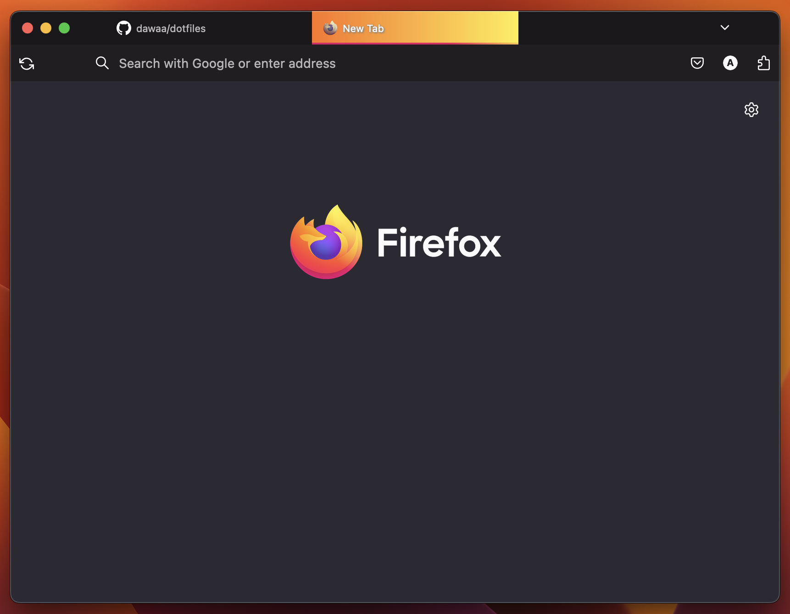

Dotfiles
========================

## Table of Contents
* [Programs](#programs)
* [Vim](#vim)
  * [Gotchas](#gotchas)
  * [CoC extensions](#coc-extensions)
* [Karabiner Elements](#karabiner-elements)
* [Color schemes](#color-schemes)
  * [To install base16-shell](#to-install-base16-shell)
* [iTerm2 key-mappings](#iterm2-key-mappings)
  * [Switching between panes](#switching-between-panes)
* [Search using Ag](#search-using-ag)
  * [Find trailing whitespaces](#find-trailing-whitespaces)
  * [Find whitespaces of death](#find-whitespaces-of-death)


### Programs

These are useful programs that are part of my everyday workflow.

Install
- `nvm` follow install instructions, https://github.com/nvm-sh/nvm
- `brew install tmux`
  - [Tmux Plugin Manager (tpm)](https://github.com/tmux-plugins/tpm) needs to be installed to install other plugins
- `brew install vim`
- `brew install git`
- `brew install fzf` &mdash; make sure key bindings are installed and sourced, `~/.fzf.bash`
- `brew install ripgrep`
- `brew install ctags` &mdash; for [`vim-gutentags`](https://github.com/ludovicchabant/vim-gutentags)
- `brew install koekeishiya/formulae/yabai`
- `brew install koekeishiya/formulae/skhd`
- `brew install jq` &mdash; as a dependency to `yabai` due to most script found online seem to rely on it
- ~[Vimac](https://vimacapp.com/) &mdash; adds Vimium-like hints to the macOS~ Will be replaced with [Homerow](https://www.homerow.app/) instead.
- [Cursorcerer](http://doomlaser.com/cursorcerer-hide-your-cursor-at-will/) &mdash; helps hiding the cursor after X seconds to increase focus
- Magnet
- Wireguard

### Vim

I use Vim for my work and like so many I've over the years tailored my `.vimrc` into my very own. Even though it's meant for myself primarily I write this to help my future-self to get my environment set up and ready so that I can start working asap..

#### Gotchas

Must run the following command below. Since I started using buffers I added a configuration setting that allows Vim to persist undo history between sessions. Where Vim will store that information is where we must create a directory before it can store it.

```
$ mkdir ~/.vim/undo
```

Don't forget to also unbind the `fn` shortcut to open "Emoji & Symbols" under
System Settings > Keyboard > Press (globe icon) key to: > "Do Nothing"

#### CoC extensions

- `coc-highlight`
- `coc-tsserver`
- `coc-eslint`
- `coc-json`

### Karabiner Elements

I use [Karabiner Elements](https://github.com/tekezo/Karabiner-Elements) to map
Option + h/j/k/l to arrow keys. This to avoid context switching even further
when having to hit those nasty-too-far-away keys and then find my way back to my
beloved h, j, k and l.

Together with `yabai` and `skhd` I've also set up a "hyper"-key that'll help
with my shortcuts.

The config I use can be found under `.config/karabiner/karabiner.json`.

## iTerm2 key-mappings

I use the following key mappings to make my life easier

### Switching between panes

| tmux cmd | mapping | hex code | description |
|----------------|---------|-------|------|
| ctrl-b + l (L) | cmd+l (L) | 0x02 0x6C | Moves to right pane |
| ctrl-b + k     | cmd+k     | 0x02 0x6B | Moves to pane above |
| ctrl-b + j     | cmd+j     | 0x02 0x6A | Moves to pane below |
| ctrl-b + h     | cmd+h     | 0x02 0x68 | Moves to left pane |
| ctrl-b + r     | cmd+r     | 0x02 0x52 | Re-runs last command in previous pane |
| ctrl-b + ;     | cmd+s     | 0x02 0x3B | Switch to last pane |

### Borderless

Under Profiles > Window > Style, set it to "No Title Bar" and restart iTerm2.

## Firefox

I've used [SimpleFox](https://github.com/migueravila/SimpleFox) as foundation and made slight modifications to it.

```css
/* userContent.css */
@-moz-document url("about:home"), url("about:newtab"), url("about:privatebrowsing"){
  .search-inner-wrapper{ display: none !important; }
}
```

and

```css
/* userChrome.css */
.urlbarView {
  /* display: none !important;*/
}

...

.tabbrowser-tab:not([pinned]) .tab-icon-image {
  filter: grayscale(75%);
  /*opacity: 0 !important;
  transition: 0.5s !important;
  width: 0px !important;*/
}

#tabbrowser-tabs:not([movingtab])
  > #tabbrowser-arrowscrollbox
  > .tabbrowser-tab
  > .tab-stack
  > .tab-background[selected='true'] {
  background: linear-gradient(90deg, rgba(254,115,34,1) 0%, rgba(255,237,74,1) 100%) !important;
  border: 4px solid;
  border-top: 0;
  border-right: 0;
  border-left: 0;
  border-image-slice: 1;
  border-width: 2px;
  border-image-source: linear-gradient(90deg, rgb(224, 13, 103) 0%, rgb(229, 18, 99) 65%, rgb(253, 203, 71) 100%);
}

#tabbrowser-tabs .tabbrowser-tab:is([selected]) {
  text-shadow: 1px 1px 2px grey, 0 0 1px grey, 0 0 0.2px grey !important;
}

#tabbrowser-tabs .tabbrowser-tab:is([selected]) .tab-close-button {
  color: black !important;
}
```


